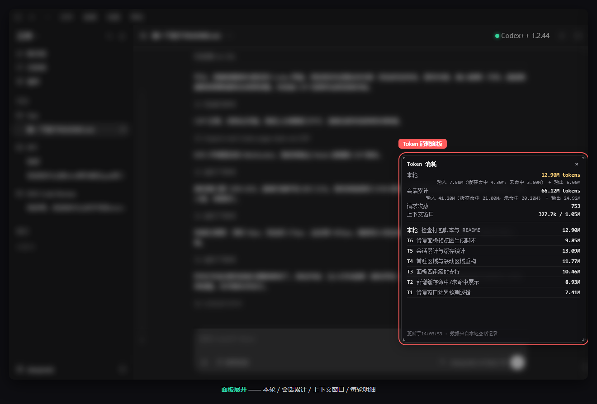

# Tokens UI For Codex - Token Usage Panel for Codex Desktop

[English](README.en.md) | [简体中文](README.md)

> 🤖 If you are an AI coding agent (Codex / Claude / Copilot, etc.), read [README.agent.md](README.agent.md) first - it is written specifically for agents.

A compact stats bar shown at the bottom of the Codex / ChatGPT **desktop** composer, to the left of the context-usage ring: session total, current-turn usage, and request count, plus the current turn's cache hit / miss / output. It refreshes immediately when data changes and pushes a fixed update every **5 seconds** when nothing changes. Left-click the bar to open a detail popover.




## How It Works

Three layers make this work; if any one is missing, the bar will not appear:

| Layer | Component | Role |
| --- | --- | --- |
| Plugin | `tokens-ui-for-codex` (Codex plugin + skill) | Documentation, troubleshooting and verification; it does not modify Codex itself |
| Page | `codex-token-spend-panel.js` (Codex++ user script) | Injects the bar and detail popover, handles interaction, placement and theme |
| Data | `token-stats.mjs --watch --cdp` (Node process) | Reads local session logs, aggregates stats, pushes a sanitized payload over local CDP (`127.0.0.1:9229`) |

Logon auto-start is handled by a Scheduled Task that launches the data layer directly: the task action is `node.exe` itself, so it never goes through PowerShell, is unaffected by execution policy, and needs no administrator rights. The monitor decides for itself whether Codex is running and stays idle (without exiting) when Codex is closed.

## Supported Environments

- **OS: Windows only** (developed and tested on Windows 10 22H2; macOS / Linux are not supported, and the logon scheduled task is Windows-specific).
- **Client: Codex / ChatGPT desktop** (codex CLI is not supported).
- **Codex++ is required** (it injects the page script and opens debug port 9229).
- **Runtime: Node.js >= 22**. There is **no prebuilt exe**, and there are no `node-version\` / `exe-version\` / `start-watch.cmd` folders.

## Quick Start

### Case 1: you have the release package (contains `.agents\`, `plugins\`, `install.bat`)

1. Extract it anywhere;
2. **Double-click `install.bat`** (checks the environment, installs the Codex++ user script, registers the Codex plugin, installs logon auto-start);
3. **Fully quit and restart Codex desktop**; the bar should appear to the left of the context-usage ring.

> Optional flags: `install.ps1 -SkipAutostart`, `install.ps1 -SkipPlugin`.

### Case 2: you have the source tree

```powershell
# 1) install the Codex++ user script
Copy-Item .\codex-token-spend-panel.js "$env:APPDATA\Codex++\user_scripts\" -Force

# 2) install logon auto-start (recommended; or run: node .\token-stats.mjs --watch --cdp)
powershell -ExecutionPolicy Bypass -File .\install-autostart.ps1

# 3) fully quit and restart Codex desktop; the bar appears left of the context-usage ring
```

`install.bat` / `install.ps1` require the release-package layout (`.agents\`, `plugins\`) and will report missing files when run from a bare source tree; use the commands above instead.

## Files

- `codex-token-spend-panel.js` - page script (copy it into the Codex++ user-script folder)
- `token-stats.mjs` - monitor and stats program (Node >= 22; `--watch --cdp` pushes stats to the page)
- `protocol.mjs` / `schemas\payload-v2.schema.json` - payload protocol and schema v2 validation
- `install-autostart.ps1` / `uninstall-autostart.ps1` - logon auto-start install/uninstall (Windows only; the scheduled task launches the Node monitor directly, with no resident daemon)
- `install.bat` / `install.ps1` - one-click installer (requires the release-package layout)
- `test\` / `scripts\` / `docs\` / `.github\` / `package.json` - tests, audits and developer tooling (not shipped in the release package)

## Panel Features

- The compact bar is inserted into the same native composer layout as the context-usage ring. From left to right it shows session total, current-turn total, and request count; the ring itself is still rendered by Codex.
- A second compact row shows current-turn cache hit, cache miss, and output. The bar's accessible label carries the full numbers.
- Left-click the bar to open a detail popover with session totals (including request count), current-turn metrics, context usage, run status, current-turn request details, and per-turn summaries. Close it by clicking outside the popover or the `×` button (`Esc` is a best-effort extra; the Codex host may consume that key first).
- The detail popover is rendered on demand; current-turn request details are capped at the latest 100 rows, and monitor heartbeats do not rebuild its DOM. This keeps long sessions lightweight.
- The old floating panel, drag/resize controls, and mini-button are removed. The Codex React bundle is not modified.
- Per-turn summaries are capped at the latest 200 turns; repeated events are never double-counted.
- The monitor reads the session JSONL incrementally (only newly appended bytes); on truncation, rewrite or same-length replacement it falls back to a safe full rebuild.
- The page payload uses schema v2 and is validated both before pushing and on receipt; a version mismatch shows an explicit state instead of silently displaying stale data.

## Logon Auto-Start (Recommended)

Registers a logon-triggered Scheduled Task that launches the Node monitor directly. It takes effect immediately; no Codex restart is needed.

```powershell
# install
powershell -ExecutionPolicy Bypass -File .\install-autostart.ps1

# uninstall
powershell -ExecutionPolicy Bypass -File .\uninstall-autostart.ps1
```

| Item | Value |
| --- | --- |
| Task name | `tokens-ui-for-codex-monitor` |
| Action | `node.exe "<package>\plugins\tokens-ui-for-codex\token-stats.mjs" --watch --cdp --port 9229` (no PowerShell involved) |
| Trigger | At logon (current user) + a 5-minute watchdog check (a no-op when the monitor is already running) |
| Multiple instances | Do not start a new instance (single-instance by construction) |
| Execution time limit | Unlimited |
| Restart on failure | 3 times / 1 minute apart |
| Run level | Limited (no administrator rights) |

The installer stops any running monitor instance and starts a fresh one, so you never end up with duplicates and do not need to close a window manually. It also cleans up the legacy guardian task, Startup-folder shortcuts and stale PID/state files from older versions.

## Data and Privacy

- It only reads Codex's own local session logs (`%USERPROFILE%\.codex\sessions\...\rollout-*.jsonl`) and **never touches any secret**.
- The payload pushed to the page contains only numbers, time labels, per-turn summaries, and up to the latest 100 request details for the current turn. It does **not** contain session file paths, thread IDs, or user-message snippets.
- Everything stays on the local machine (`127.0.0.1:9229`); nothing is uploaded.
- With multiple Codex windows it prefers the single focused window, then the single visible one; if it still cannot decide, the monitor asks for `--target <target-id>` instead of writing to a random window.

## Key Paths

| Item | Path / name |
| --- | --- |
| State directory | `%LOCALAPPDATA%\ccm-token-spend` |
| Monitor log | `%LOCALAPPDATA%\ccm-token-spend\logs\watch-YYYYMMDD.log` |
| Health status | `%LOCALAPPDATA%\ccm-token-spend\monitor-health.json` |
| Auto-start state | `%LOCALAPPDATA%\ccm-token-spend\autostart-state.json` |
| Page script | `%APPDATA%\Codex++\user_scripts\codex-token-spend-panel.js` |
| Scheduled task | `tokens-ui-for-codex-monitor` |
| Plugin | `tokens-ui-for-codex@tokens-ui-for-codex-local` |
| CDP port | `127.0.0.1:9229` |

## For Developers: CLI Stats (No Panel Needed)

```powershell
node token-stats.mjs                  # most recent thread
node token-stats.mjs --thread <id>    # specific thread
node token-stats.mjs --detail         # include per-request details
node token-stats.mjs --all            # cumulative usage across all threads
```

## How Numbers Are Calculated

- "Session total" = sum of billed tokens across all requests in the thread (including context re-sent in every turn).
- "Context window (used/total)" = used is the context usage of the latest request in the current thread; total is the model context window size.
- "Per turn / current turn" = all requests between one user message and the next.
- Input cache split: `Input X (cached Y, uncached Z)`, where uncached = input - cached; old logs without cache fields automatically show `Input X + Output W`.
- A new thread with no data yet shows 0 instead of "no data", and switching to a blank thread never shows the previous thread's numbers.
- During Codex startup before the UI finishes loading, it shows 0; after loading completes it automatically shows the current thread's data.

## Troubleshooting

| Symptom | What to do |
| --- | --- |
| Bar does not appear | Make sure Codex++ is installed, the page script is in `%APPDATA%\Codex++\user_scripts\`, and Codex desktop was **fully restarted** |
| Bar stays at 0 | The monitor is not running (`node token-stats.mjs --watch --cdp`), or the current thread is a blank new one |
| "Waiting for data" after a restart | Check the `tokens-ui-for-codex-monitor` task state and last run result, then re-run `install-autostart.ps1` |
| Numbers stop updating | Check `logs\watch-YYYYMMDD.log` and `monitor-health.json`, then restart the monitor |
| Asks for `--target` | Multiple Codex windows; add `--target <target-id>` as suggested |
| Wrong thread | Use `node token-stats.mjs --thread <id>`, or list threads with `--all` |
| Missing runtime | Install Node.js >= 22, or build an exe (below) and place it at `exe-version\ccm-token-spend.exe` |

## Uninstall

```powershell
# 1) remove logon auto-start (also cleans the page script and the plugin registration)
powershell -ExecutionPolicy Bypass -File .\uninstall-autostart.ps1 -RemoveUserScript -RemovePlugin

# 2) or clean up manually:
Remove-Item "$env:APPDATA\Codex++\user_scripts\codex-token-spend-panel.js" -Force
codex plugin remove tokens-ui-for-codex@tokens-ui-for-codex-local

# 3) fully quit and restart Codex desktop
```

`uninstall-autostart.ps1` keeps logs and state by default; add `-PurgeState` to delete the state directory as well.

## Resource Usage (Measured)

Windows 10 22H2 / Node.js 24, steady-state sampling:

| Metric | Value |
| --- | --- |
| Resident processes | 1 (the Node monitor) |
| CPU | about 0.2% of one core |
| Memory | about 70 MB |

CPU is measured with the delta method (two samples of cumulative CPU time) to avoid startup noise; memory is the resident working set and fluctuates slightly with session length.

## For Developers: Tests and Packaging

```powershell
npm test            # unit tests (Node built-in node:test, 34 cases today)
npm run check       # syntax check
npm run test:live   # live UI tests (needs Codex desktop + CDP port)
npm run perf        # performance baseline
```

- Build the release zip (run it against a **deployment directory** containing `.agents\`, `plugins\`, `DEPLOYMENT.md`):

  ```powershell
  powershell -ExecutionPolicy Bypass -File scripts\build-package.ps1 -SourceRoot "<deployment dir>"
  ```

- Build the exe (optional, requires `@yao-pkg/pkg`):

  ```powershell
  mkdir build; cd build
  npm install @yao-pkg/pkg
  .\node_modules\.bin\pkg ..\token-stats.mjs --target node22-win-x64 --output ..\ccm-token-spend.exe
  ```

  Then place it at `<package>\plugins\tokens-ui-for-codex\exe-version\ccm-token-spend.exe`; the installer picks it up automatically as the no-Node fallback runtime.

## Changelog

See [CHANGELOG.md](CHANGELOG.md) for version history.

## Test Environment

- Windows 10 22H2 (build 19045)
- Codex desktop 26.727.6591.0
- Codex++ 1.2.44
- Node.js v24.14.1
- Currently uses a **third-party API** and was tested with a **single fixed model**; **switching models** (mid-thread) has not been tested.
- Verified: CLI stat output, compact-bar placement, detail popover open / close / section rendering, full turn summaries, current-turn request-detail cap, session-total cache split, context window used/total, blank new thread showing 0, and logon auto-start (scheduled task launches the Node monitor directly, single instance, automatic restart after a crash).
- macOS / Linux not tested.

## 📝 Environment Test Reports (Contributions Welcome)

After testing, please share your environment to help us gather more compatibility data. Create a new discussion in the **General** category on [GitHub Discussions](https://github.com/Littps/Tokens-UI-For-Codex-Token-/discussions) and fill in the template:

- **Version**: e.g. `v1.0.0`
- **OS**: e.g. Windows 10 / Windows 11
- **Codex desktop version**: e.g. `26.727.6591.0`
- **Codex++ version**: e.g. `1.2.44`
- **Ran successfully?**: success / partial issues / failed

## Acknowledgements

The built-in "current thread ID" detection logic references the open-source project [codex-context-used-meter](https://github.com/Minghou-Lei/codex-context-used-meter) (MIT License). It has been fully re-implemented in-house; no external script is required and no extra installation is needed.

## License

This project is licensed under the [MIT License](LICENSE), copyright (c) 2026 Littps.

> Note: the third-party project acknowledged above keeps its own MIT attribution; it is independent of this project's license.
