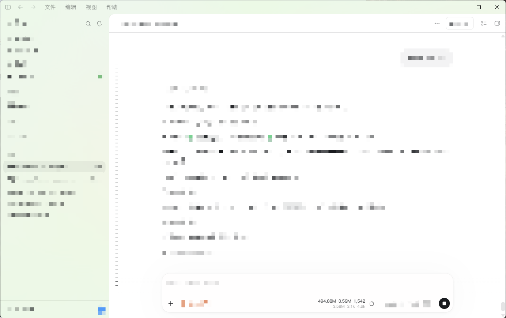
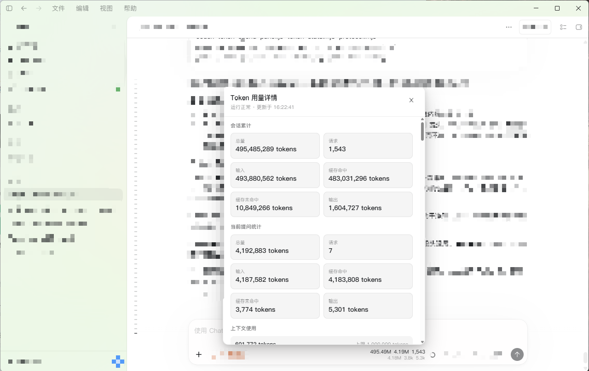

# Tokens UI For Codex —— Codex 桌面版 Token 用量面板

[English](README.en.md) | [简体中文](README.md)

> 🤖 如果你是 AI 编码助手（Codex / Claude / Copilot 等），请直接阅读 [README.agent.md](README.agent.md) —— 专为 Agent 编写的安装指南。

在 Codex / ChatGPT **桌面版**输入区底部、上下文用量圆圈左侧显示紧凑统计：会话累计、当前提问消耗、请求次数，以及当前提问的缓存命中 / 未命中 / 输出量。数据变化时立即刷新，无变化时每 **5 秒**固定推送一次；左键单击统计条可打开详细页面。





## 工作原理

本工具由三层组成，任何一层缺失都会导致统计条不显示：

| 层 | 组件 | 作用 |
| --- | --- | --- |
| 插件层 | `tokens-ui-for-codex`（Codex 插件 + 技能） | 提供说明、排障与验证方法；不修改 Codex 本体 |
| 页面层 | `codex-token-spend-panel.js`（Codex++ 用户脚本） | 把统计条与详情弹层注入页面，负责交互、定位与主题适配 |
| 数据层 | `token-stats.mjs --watch --cdp`（Node 进程） | 读取本地会话日志、聚合成统计，通过本机 CDP（`127.0.0.1:9229`）推送脱敏负载 |

登录自启由一个计划任务负责拉起数据层：任务动作直接是 `node.exe`，不经过 PowerShell，所以不受执行策略影响，也不需要管理员权限。监控进程自己判断 Codex 是否在运行，Codex 不在时保持待命而不退出。

## 支持环境

- **操作系统：仅 Windows**（开发与测试基于 Windows 10 22H2；macOS / Linux 未支持，登录自启的计划任务为 Windows 专属）。
- **客户端：Codex / ChatGPT 桌面版**（不支持 codex CLI）。
- **必须安装 Codex++**（负责把面板脚本注入页面并开放调试端口 9229）。
- **运行时：Node.js ≥ 22**。本项目**不提供预编译 exe**，也没有 `node-version\` / `exe-version\` / `start-watch.cmd` 这类目录。

## 快速开始

### 情况一：你拿到的是发布包（含 `.agents\`、`plugins\`、`install.bat`）

1. 解压到任意目录；
2. **双击 `install.bat`**（依次完成：检查环境 → 安装 Codex++ 用户脚本 → 注册 Codex 插件 → 安装登录自启）；
3. **完全退出并重启 Codex 桌面版**，统计条应出现在上下文用量圆圈左侧。

> 可选参数：`install.ps1 -SkipAutostart`（不装自启）、`install.ps1 -SkipPlugin`（不注册插件）。

### 情况二：你拿到的是源码目录

```powershell
# 1) 安装 Codex++ 用户脚本
Copy-Item .\codex-token-spend-panel.js "$env:APPDATA\Codex++\user_scripts\" -Force

# 2) 安装登录自启（推荐；也可以手动运行 node .\token-stats.mjs --watch --cdp）
powershell -ExecutionPolicy Bypass -File .\install-autostart.ps1

# 3) 完全退出并重启 Codex 桌面版，统计条出现在上下文用量圆圈左侧
```

源码目录下 `install.bat` / `install.ps1` 需要发布包布局（`.agents\`、`plugins\`），会因缺少文件而提示；源码场景请直接使用上面的命令。

## 文件说明

- `codex-token-spend-panel.js` — 页面脚本（复制到 Codex++ 用户脚本目录）
- `token-stats.mjs` — 监控与统计程序（Node ≥ 22；`--watch --cdp` 把统计推送到页面）
- `protocol.mjs` / `schemas\payload-v2.schema.json` — 负载协议与 schema v2 校验
- `install-autostart.ps1` / `uninstall-autostart.ps1` — 登录自启安装与卸载（Windows 专属；计划任务直接拉起 Node 监控，无常驻守护进程）
- `install.bat` / `install.ps1` — 一键安装脚本（需要发布包布局）
- `test\` / `scripts\` / `docs\` / `.github\` / `package.json` — 测试、审计与开发工具（不随发布包分发）

## 面板说明

- 统计条与 Codex 原生上下文用量圆圈处于同一横向布局，从左到右依次为「会话 / 当前提问 / 请求」，右侧圆圈仍由 Codex 原生显示。
- 第二行简略显示当前提问「命中 / 未命中 / 输出」；统计条的无障碍标签提供完整数字。
- 左键单击统计条打开详情弹层，分区显示会话累计（含请求数量）、当前提问统计、上下文进度、运行状态、当前提问请求明细和各轮摘要；点击弹层外部或右上角 `×` 关闭（`Esc` 为增强，Codex 宿主可能先拦截该按键）。
- 详情弹层按需创建，当前轮请求明细最多展示最近 100 条；监控心跳不会重复重建详情 DOM，适合长会话。
- 不创建右下角悬浮面板、拖拽缩放控件或小按钮，也不修改 Codex React bundle。
- 当前轮请求明细最多展示最近 100 条，轮次摘要最多展示最近 200 轮；连续重复事件不会重复计数。
- 监控使用增量 JSONL 读取：只读取会话文件新增字节；发现截断、重建或同长度替换时自动回退到安全的全量重建。
- 页面负载协议为 schema v2，推送前与页面接收时分别校验；版本不匹配会显示明确状态，不会静默展示旧数据。

## 登录自启（推荐）

注册一个登录触发的计划任务，由 Windows 直接拉起 Node 监控进程。安装后立即生效，无需重启 Codex。

```powershell
# 安装
powershell -ExecutionPolicy Bypass -File .\install-autostart.ps1

# 卸载
powershell -ExecutionPolicy Bypass -File .\uninstall-autostart.ps1
```

| 项目 | 值 |
| --- | --- |
| 计划任务名 | `tokens-ui-for-codex-monitor` |
| 任务动作 | `node.exe "<包目录>\plugins\tokens-ui-for-codex\token-stats.mjs" --watch --cdp --port 9229`（不经过 PowerShell） |
| 触发器 | 登录时（当前用户）+ 每 5 分钟兜底巡检（已在运行时空转，不产生新进程） |
| 重复实例 | 不启动新实例（天然单实例） |
| 运行时限 | 不限 |
| 失败重启 | 3 次 / 间隔 1 分钟 |
| 运行级别 | Limited（不需要管理员权限） |

安装脚本会先停掉正在运行的监控实例再重新拉起，因此不会出现双实例，也不需要你手动关闭窗口；同时它会清理旧版本遗留的守护任务、启动文件夹快捷方式和 PID/状态文件。

## 数据与隐私

- 只读取 Codex 自己的本地会话日志（`%USERPROFILE%\.codex\sessions\...\rollout-*.jsonl`），**不涉及任何密钥**。
- 推送到页面的负载只包含数字统计、时间标签、轮次摘要和当前提问最近最多 100 条请求明细；**不包含**会话文件路径、线程 ID 或用户消息片段。
- 所有数据传输都发生在本机（`127.0.0.1:9229`），不上传任何数据。
- 多窗口默认优先选择唯一获得焦点的 Codex 窗口，其次选择唯一可见窗口；若仍无法判断，监控会提示使用 `--target <target-id>`，不会把数据写入随机窗口。

## 关键路径速查

| 项目 | 路径 / 名称 |
| --- | --- |
| 状态目录 | `%LOCALAPPDATA%\ccm-token-spend` |
| 监控日志 | `%LOCALAPPDATA%\ccm-token-spend\logs\watch-YYYYMMDD.log` |
| 健康状态 | `%LOCALAPPDATA%\ccm-token-spend\monitor-health.json` |
| 自启状态 | `%LOCALAPPDATA%\ccm-token-spend\autostart-state.json` |
| 页面脚本 | `%APPDATA%\Codex++\user_scripts\codex-token-spend-panel.js` |
| 计划任务 | `tokens-ui-for-codex-monitor` |
| 插件 | `tokens-ui-for-codex@tokens-ui-for-codex-local` |
| CDP 端口 | `127.0.0.1:9229` |

## 命令行直接查看（无需面板）

```powershell
node token-stats.mjs                  # 最近一个对话
node token-stats.mjs --thread <id>    # 指定对话
node token-stats.mjs --detail         # 附带每次请求明细
node token-stats.mjs --all            # 所有对话的累计消耗
```

## 统计口径

- 「会话累计」= 该对话所有请求的 billed token 之和（含每轮重复发送的上下文）。
- 「上下文窗口（已用/总量）」= 已用为当前对话最新一次请求的上下文占用，总量为模型上下文窗口大小。
- 「每轮 / 当前提问」= 一次用户消息到下一次用户消息之间发生的所有请求。
- 输入缓存拆分：`输入 X（缓存命中 Y，未命中 Z）`，其中未命中 = 输入 − 缓存命中；旧日志没有缓存字段时自动显示为 `输入 X + 输出 W`。
- 新对话（尚无数据）显示 0，而不是「暂无数据」；切到空白新对话时不会显示上一个对话的数据。
- Codex 刚启动、界面尚未加载完成时显示 0，加载完成后自动显示当前对话的数据（不回退显示上一个对话）。

## 排障

| 现象 | 处理 |
| --- | --- |
| 统计条不出现 | 确认已装 Codex++、页面脚本已复制到 `%APPDATA%\Codex++\user_scripts\`、并**完全重启**过 Codex 桌面版 |
| 统计条出现但一直是 0 | 监控没在跑（`node token-stats.mjs --watch --cdp`），或当前是空白新对话（新对话固定显示 0） |
| 重启后显示「等待数据」 | 检查计划任务 `tokens-ui-for-codex-monitor` 的状态与上次运行结果，再重新运行 `install-autostart.ps1` |
| 数字不刷新 | 查看 `logs\watch-YYYYMMDD.log` 与 `monitor-health.json`，必要时重启监控 |
| 提示需要 `--target` | 多窗口下无法唯一判断目标窗口，按提示加 `--target <target-id>` |
| 默认对话不对 | 用 `node token-stats.mjs --thread <id>` 指定，或先用 `--all` 看有哪些对话 |
| 运行时缺失 | 需要 Node.js ≥ 22；或自行打包 exe（见下）放到 `exe-version\ccm-token-spend.exe` |

## 卸载

```powershell
# 1) 卸载登录自启（如装过）；一并清理页面脚本与插件注册
powershell -ExecutionPolicy Bypass -File .\uninstall-autostart.ps1 -RemoveUserScript -RemovePlugin

# 2) 如果只想手动清理：
Remove-Item "$env:APPDATA\Codex++\user_scripts\codex-token-spend-panel.js" -Force
codex plugin remove tokens-ui-for-codex@tokens-ui-for-codex-local

# 3) 完全退出并重启 Codex 桌面版
```

`uninstall-autostart.ps1` 默认保留日志与状态；加 `-PurgeState` 才会连同状态目录一起删除。

## 资源占用（实测）

Windows 10 22H2 / Node.js 24，稳态增量采样（统计口径见下）：

| 指标 | 数值 |
| --- | --- |
| 常驻进程 | 1 个（Node 监控进程） |
| CPU | 约 0.2% 单核 |
| 内存 | 约 70 MB |

CPU 用区间增量法测量（采两次累计 CPU 时间求差），避开进程启动期的抖动；内存为常驻工作集，会随会话长度小幅波动。

## 开发者：测试与打包

```powershell
npm test            # 单元测试（Node 内置 node:test，当前 34 项）
npm run check       # 语法检查
npm run test:live   # 实机 UI 测试（需要 Codex 桌面版 + CDP 端口）
npm run perf        # 性能基线
```

- 打包发布包 zip（在**部署目录**上运行，该目录含 `.agents\`、`plugins\`、`DEPLOYMENT.md`）：

  ```powershell
  powershell -ExecutionPolicy Bypass -File scripts\build-package.ps1 -SourceRoot "<部署目录>"
  ```

- 打包 exe（可选，需自行准备 `@yao-pkg/pkg`）：

  ```powershell
  mkdir build; cd build
  npm install @yao-pkg/pkg
  .\node_modules\.bin\pkg ..\token-stats.mjs --target node22-win-x64 --output ..\ccm-token-spend.exe
  ```

  生成后放到 `<包目录>\plugins\tokens-ui-for-codex\exe-version\ccm-token-spend.exe`，安装脚本会把它当作无 Node 时的回退运行时。

## 更新记录（Changelog）

版本更新说明见 [CHANGELOG.md](CHANGELOG.md)。

## 测试环境

- Windows 11 25H2
- ChatGPT 桌面版 26.908.70816
- Codex++ 1.2.56
- Node.js v24.14.1
- 对话过程中切换模型不影响展示效果
- 已实测：命令行统计输出、紧凑统计条定位、详情弹层打开 / 关闭 / 分区渲染、轮次全量摘要、当前轮请求明细上限、会话累计缓存拆分、上下文窗口已用/总量、空白新对话显示 0、登录自启（计划任务直接拉起 Node 监控、单实例、崩溃后自动重启）。
- macOS / Linux 未测试。

## 📝 环境测试报告（欢迎参与）

欢迎大家测试后分享自己的运行环境，帮助项目收集更多兼容性数据。请在 [GitHub Discussions](https://github.com/Littps/Tokens-UI-For-Codex-Token-/discussions) 的 **General** 分类新建讨论，按模板填写即可（会自动带上「测试报告」标签）：

- **版本号**：如 `v1.0.0`
- **操作系统**：如 Windows 10 / Windows 11
- **Codex 桌面版版本号**：如 `26.727.6591.0`
- **Codex++ 版本号**：如 `1.2.44`
- **是否成功运行**：成功 / 部分功能异常 / 失败

## 致谢

内置的「当前对话 ID」检测逻辑参考了开源项目 [codex-context-used-meter](https://github.com/Minghou-Lei/codex-context-used-meter)（MIT License），已完全自研集成，不依赖任何外部脚本、无需额外安装。

## 许可证

本项目采用 [MIT License](LICENSE)，版权归 `Littps` 所有。

> 说明：上述第三方项目仍按其自身许可证署名（MIT），与本项目的许可证相互独立。
