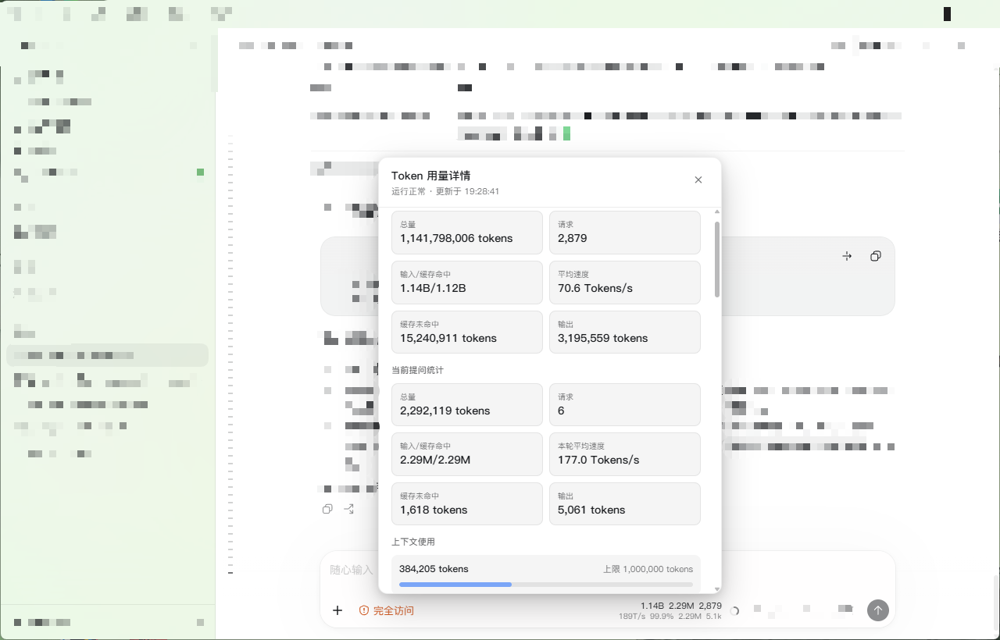
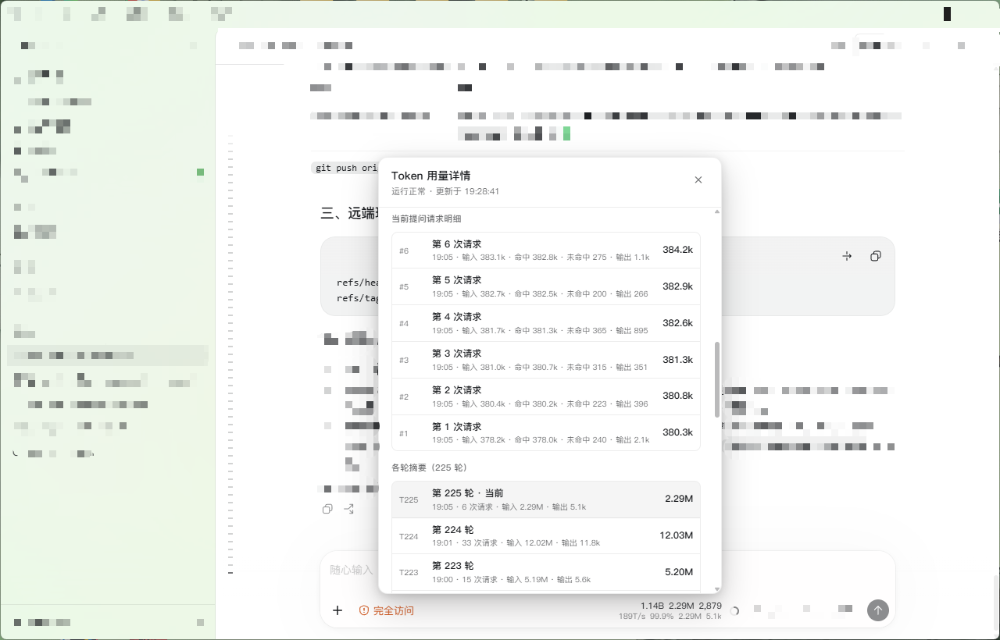

# Tokens UI For Codex

在 Codex 桌面版里查看当前会话的 Token 用量：**原生风格的紧凑统计条** + **可点击的详情弹层**。
不修改 Codex 的任何文件，不注入键盘事件，不读取或展示你的对话正文。

- 作者：**Littps**
- 平台：Windows 10 / 11（仅桌面版 Codex）

## 它长什么样




统计条固定在**输入区右下、上下文用量圆圈的左侧**，两行显示：

```
会话  当前提问  请求
速度  命中率  命中  输出
```

左键单击统计条打开**详情弹层**，六个分区：

| 分区 | 内容 |
| --- | --- |
| 会话累计 | 总量 / 请求 / 输入·缓存命中 / 平均速度 / 缓存未命中 / 输出 |
| 当前提问统计 | 总量 / 请求 / 输入·缓存命中 / **本轮平均速度** / 缓存未命中 / 输出 |
| 上下文使用 | 已用 tokens、上限 tokens 与占用比例 |
| 运行状态 | 状态 / 监控 / 页面连接 / 数据 / 窗口选择 / 模型切换 / 累计重置 / 恢复 |
| 当前提问请求明细 | **默认最近 10 条**，可点「加载更多」每次再加 20 条 |
| 各轮摘要 | **默认最近 25 轮**，可点「加载更多」每次再加 50 轮 |

两个列表都是**倒序**（最新的在最上面）；未展示的部分**不会推送到页面**，只有点按钮才按需拉取，上限各 500 条。

关闭弹层：点击弹层外部，或点右上角 `×`。**插件不注册任何键盘监听**，Esc 不会关闭弹层。
鼠标停留在统计条上时**冻结刷新**（数字与提示都不再变化），移开后立即追上最新值——方便阅读与复制。

## 环境要求

| 依赖 | 要求 | 说明 |
| --- | --- | --- |
| 操作系统 | Windows 10 / 11 | 本项目只支持 Windows |
| Codex | 桌面版 | 面板注入的是桌面版渲染进程的页面 |
| Codex++ | 已安装并启用用户脚本 | 统计条本体以 Codex++ 用户脚本形式注入 |
| Node.js | **22 或更高** | 通常无需单独安装：Codex 桌面版自带运行时（实测 v24）可直接复用 |

安装器会自动定位 Node：先查 `PATH`，再找 Codex 自带运行时，最后查常见安装位置；都找不到时**明确报错并提示安装**，不会静默失败。

## 安装

### 一键安装（推荐）

双击包内的 `install.bat`（自动优先 PowerShell 7，其次 Windows PowerShell 5.1）：

1. 检查环境（系统 / Node / Codex++ / Codex 桌面版 / `codex` 命令）
2. 安装 Codex++ 用户脚本（复制后校验 SHA-256；若目录下存在历史面板脚本，按**脚本内容**识别并停用为 `.superseded-*.bak`）
3. 注册 Codex 本地插件（提供技能，可让 Agent 解释原理与排障）
4. 安装登录自启（注册计划任务，**不需要管理员权限**）
5. 自检并输出结果

### 手动安装（三步）

```powershell
# 1) 用户脚本（统计条本体）
Copy-Item ".\plugins\tokens-ui-for-codex\tokens-ui-for-codex-panel.js" "$env:APPDATA\Codex++\user_scripts\" -Force

# 2) 注册 Codex 本地插件（技能，可让 Agent 解释与排障）
codex plugin marketplace add .\
codex plugin add tokens-ui-for-codex@tokens-ui-for-codex-local

# 3) 登录自启（注册计划任务；不需要管理员）
pwsh -NoProfile -ExecutionPolicy Bypass -File .\plugins\tokens-ui-for-codex\install-autostart.ps1
```

## 自动启动与巡检

计划任务 `tokens-ui-for-codex-monitor` 负责拉起监控进程：

- **触发**：安装完成后立即执行一次 + 登录时启动 + 每 5 分钟兜底巡检
- **动作**：`wscript.exe → launch-silent.vbs → node`（无终端窗口，不经 PowerShell，不受执行策略影响）
- **重复实例**：不启动新实例（已在运行时空转，不产生新进程）；失败重启 3 次 / 间隔 1 分钟；运行时限不限
- **权限**：用户级（RunLevel Limited），不需要管理员，不弹 UAC

Codex 不在运行时监控保持待命，不会退出；Codex 启动后自动开始上报。

## 刷新节奏与数据可靠性

- **数据变化立即推送**；无变化时按状态心跳：**检测到任务正在运行 → 1 秒一次心跳**，否则 5 秒一次
- **展开态不参与心跳**：当你打开了长列表（窗口大于默认档），这份数据只在真正变化时才推送，避免无意义地重复发送大负载
- **会话分片**：宿主在会话文件过大时会切分成多个文件，监控自动归组、合并、按时间排序后再统计
- **增量解析**：记录文件偏移与半行缓存；检测到截断、重建或同长度替换时按新基线重建，不沿用旧统计
- **两级停滞告警**：5 分钟无新增仅在日志预警；15 分钟降级为 `stale-data`（页面显示降级状态），恢复后自动回到 `healthy`
- **错峰回声/重放**：同一请求在两代日志格式下重复出现时，按内容一一认领，不重复计数；滞后超过 60 秒的会单独统计并在日志里附 top-3 时间戳

## 卸载

```powershell
# 标准卸载：删除计划任务、停止进程、保留日志与状态目录
pwsh -NoProfile -ExecutionPolicy Bypass -File .\plugins\tokens-ui-for-codex\uninstall-autostart.ps1

# 一键全清：额外删除日志/状态、用户脚本（含安装备份）、插件与插件缓存
pwsh -NoProfile -ExecutionPolicy Bypass -File .\plugins\tokens-ui-for-codex\uninstall-autostart.ps1 -Full
```

卸载脚本按**动作指向**识别本插件的计划任务与启动快捷方式、按**脚本内容**识别本插件的用户脚本，因此不依赖任何历史文件名。

## 数据与隐私

- 页面负载**只包含**：数字统计、时间标签、各轮摘要与当前轮的有限请求明细
- **不包含**：会话文件路径、线程 ID、用户消息片段、Token、密钥或任何凭据
- 监控进程读取本地会话日志，但**只提取结构化数值**，不复制、不展示、不外传正文
- 页面与监控通过本机 CDP（默认 `127.0.0.1:9229`）通信，不经过网络
- 面板不注册键盘监听、不修改 Codex 的 React bundle、不写入任何 Codex 配置文件

## 排障

| 现象 | 先看什么 |
| --- | --- |
| 完全没有统计条 | Codex++ 是否运行并启用了用户脚本；`%APPDATA%\Codex++\user_scripts\tokens-ui-for-codex-panel.js` 是否存在；然后重载页面 |
| 统计条显示「等待数据」 | 监控进程是否存活；健康快照 `%LOCALAPPDATA%\tokens-ui-for-codex\monitor-health.json`；日志 `...\logs\watch-YYYY-MM-DD.log` |
| 数字长时间不动 | 先看日志有无「数据停滞 / 定位失败 / 定位预警」记录；会话很长时宿主可能正在写分片 |
| 速度看起来更新很慢 | **这是数据源决定的**：数值只在 Codex 写入用量记录时变化，实测到达间隔中位约 2.9 秒、p90 约 14.7 秒；心跳只能改善「界面像不像卡住」，不能凭空产生新数据 |
| 多窗口时停在「需要指定窗口」 | 用 `--target <ID>` 指定目标页面 |

```powershell
# 监控是否存活
Get-ScheduledTask -TaskName tokens-ui-for-codex-monitor | Get-ScheduledTaskInfo
Get-CimInstance Win32_Process -Filter "Name='node.exe'" | Where-Object { $_.CommandLine -match 'token-stats.mjs' }
```

## 技术原理（简述）

两部分协作：

1. **面板（Codex++ 用户脚本）**：把统计条挂到原生上下文圆圈左侧；不 patch React，只做 DOM 挂载 + 增量更新；详情弹层骨架只构建一次，之后按字段增量刷新。
2. **监控进程（Node）**：读取本地会话日志 → 统计 → 通过 CDP 把 schema v2 负载推到页面 → 页面派发 `tokens-ui-for-codex` 事件驱动重绘。

**速度口径**（两格都取自官方数据，不是估算）：

- 当前提问统计的「本轮平均速度」= Σ本轮输出 ÷ Σ本轮生成耗时
- 会话累计的「平均速度」= Σ会话输出 ÷ Σ会话生成耗时

> 生成过程中的「实时 T/s」在当前 Codex 渲染方式下**无法可靠实现**（日志里没有逐块事件；页面按节点替换而非字符追加，实测 25 秒窗口内子节点新增 352 个、字符变更仅 28 次净增 13 字符；轮块文本长度在 145↔10586 之间伸缩）。因此本项目不做实时估算，只显示可对账的官方口径。

## 目录结构（部署包）

```
Tokens UI For Codex/
├─ install.bat                       一键安装入口
├─ DEPLOYMENT.md                     部署与安装说明
├─ .agents/plugins/marketplace.json  本地 marketplace 清单
└─ plugins/tokens-ui-for-codex/
   ├─ .codex-plugin/plugin.json      插件清单（署名 Littps）
   ├─ tokens-ui-for-codex-panel.js   Codex++ 用户脚本（统计条 + 详情弹层）
   ├─ token-stats.mjs                监控进程（读取会话、统计、CDP 推送）
   ├─ protocol.mjs / schemas/        协议契约与 schema
   ├─ install.ps1 / install-autostart.ps1 / uninstall-autostart.ps1
   ├─ find-codex.ps1                 动态定位 codex / Node / Codex++
   ├─ skills/tokens-ui-for-codex/    插件技能说明
   └─ scripts/ test/ docs/           工具脚本、测试与规格
```

## 许可

MIT License · Copyright (c) 2026 **Littps**
